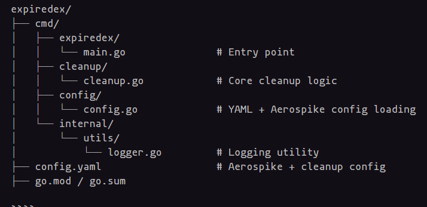

```markdown
# 🧹 ExpireDex

> A simple Golang service to scan and delete expired OTP keys in Aerospike using a rule-based key prefix and date format.

---

## 🚀 What is ExpireDex?

**ExpireDex** is a cleanup service that:

- Scans all records in an Aerospike namespace/set
- Identifies keys with a specific prefix (e.g., `delete_on:YYYYMMDD:keyN`)
- Parses date from key and deletes expired ones
- Supports **dry-run** mode for safety
- Can generate fake keys for local testing

---

## 📦 Project Structure

```


````

---

## ⚙️ Configuration (`config.yaml`)

```yaml
aerospike:
  host: "127.0.0.1"
  port: 3000
  namespace: "test"
  set: "otp_data"

cleanup:
  key_prefix: "delete_on:"
  date_format: "20060102"
````

---

## 🛠️ Setup & Run

### 1. Clone & Install

```bash
git clone https://github.com/your-username/expiredex.git
cd expiredex
go mod tidy
```

### 2. Configure `.env`

(Optional) Create `.env` for any secrets or logging config.

### 3. Run the Service

```bash
go run cmd/expiredex/main.go
```

This will:

* Insert 5 fake OTP records (2 expired, 3 future)
* Run cleanup logic
* Print deleted keys and their timestamps

---

## 💡 Features

| Feature                  | Status |
| ------------------------ | ------ |
| Configurable key prefix  | ✅      |
| Key date parsing         | ✅      |
| Dry-run safe mode        | ✅      |
| Fake data generator      | ✅      |
| Logs with banner         | ✅      |
| Modular folder structure | ✅      |

---

## 🧪 Example Output

```
✅ Found key with prefix: delete_on:20250727:key1
NOW: 20250727 KEY_DATE: 20250727
⏰ Expired date: 2025-07-27
🧹 Successfully deleted: delete_on:20250727:key1
```

---

## ✅ Future Roadmap

* [ ] CLI tool with flags (`--dry-run`, `--range=7d`, etc.)
* [ ] Scheduled CRON execution
* [ ] Dashboard/GUI to track expired/deleted keys
* [ ] Integration with Slack/email alerts
* [ ] Aerospike TTL support

---

## 👨‍💻 Author

**Hari Aneesh Siddhartha**
Built with ❤️ in Go to level up backend skills and clean up key clutter!

---

## 📄 License

MIT — feel free to use and contribute!

